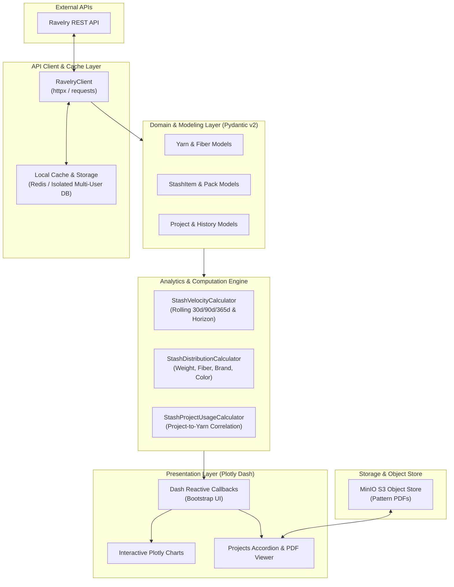

<div align="center">

# StashStats

**An AI-Engineered Analytics Engine & Management Platform for Yarn Stashes and Ravelry Data**

[](https://www.python.org/)
[](https://dash.plotly.com/)
[](https://docs.pydantic.dev/)
[](tests/)
[](https://github.com/astral-sh/ruff)
[](docker-compose.yml)
[](https://min.io/)

</div>

---

## Executive Summary

**StashStats** is a production-grade web application and analytical engine built with **Python 3.11**, **Plotly Dash**, and **Pydantic v2**. It connects to the Ravelry API to ingest personal yarn inventories, track consumption velocity, forecast stash lifespan horizons, and manage project pattern PDFs via an integrated S3-compatible MinIO object store.

---

## AI-First Engineering Methodology

> **"AI-Engineered, Not Vibe Coded."**

StashStats began as an exploratory prototype to map the Ravelry API schema and core fiber arts domain rules. The project was subsequently transitioned into a disciplined, **AI-First Engineering lifecycle** driven by formal specifications, contract modeling, and deterministic test suites.

```
┌─────────────────┐     ┌─────────────────┐     ┌─────────────────┐     ┌─────────────────┐
│  Conductor Spec │ ──> │   TDD Red/Green │ ──> │ Pydantic Schema │ ──> │   Verification  │
│  & Track Plans  │     │   (381+ Tests)  │     │ & Architecture  │     │  & Checkpoints  │
└─────────────────┘     └─────────────────┘     └─────────────────┘     └─────────────────┘
```

### Key Engineering Standards
- **Spec-Driven Track Lifecycle ([Conductor](conductor/)):** Every feature, refactor, and fix followed structured specifications (`spec.md`), phased implementation checklists (`plan.md`), phase checkpoints, and auditable Git notes across 16+ tracks.
- **Deterministic Test-Driven Development:** 381 automated unit and integration tests validating API client responses, data caching, consumption velocity math, and reactive UI callbacks.
- **Contract-Driven Domain Modeling:** Replaced loose JSON dictionaries with immutable, validated Pydantic v2 models (`StashItem`, `Yarn`, `Project`, `HistoryEntry`).
- **Reproducible Infrastructure:** Containerized with Docker Compose, MinIO object storage, Redis/PostgreSQL caching, and managed via `uv`.

---

## System Architecture



---

## Key Feature Highlights

- **Consumption Velocity & Lifespan Forecasting:** Calculates yarn burn rate across rolling windows (30d, 90d, 365d) and computes stash depletion horizon forecasts.
- **Dynamic Inventory Analytics:** Visual distributions of yarn weights, fiber compositions, color families, and brand allocations with yard/meter unit toggling.
- **Projects Manager & PDF Pattern Viewer:** Grouped accordion interface with integrated drag-and-drop pattern PDF uploads backed by MinIO object storage.
- **Bi-Directional Synchronization:** Track local edits, record usage events with date-stamped history ledgers, and sync back to Ravelry.
- **Dev/Prod Multi-Account Switcher:** Seamless runtime switching between mock sandbox data and live authenticated accounts.

---

## Quickstart

### Option 1: Docker Compose (Recommended)

```bash
# Clone repository
git clone https://github.com/BeigePowerRanger/StashStats.git
cd StashStats

# Copy environment variables
cp .env.example .env

# Launch application stack (Dash App + MinIO)
docker compose up -d

# Open in browser
open http://localhost:8000
```

### Option 2: Local Development with `uv`

```bash
# Install dependencies with uv
uv sync --all-extras

# Run the Dash development server
uv run python app.py
```

---

## Testing & Code Quality

```bash
# Run complete test suite (381 unit & integration tests)
uv run --all-extras pytest

# Run fast lint checks with Ruff
uv run ruff check src/ tests/

# Run code formatting check
uv run ruff format --check src/ tests/
```

---

## Repository Layout

```
StashStats/
├── conductor/         # Conductor spec-driven development tracks & plans
├── src/stashstats/    # Core package
│   ├── analytics/     # Velocity, distribution, and consumption math engines
│   ├── client/        # Ravelry API client & endpoint adapters
│   ├── models/        # Pydantic v2 domain schemas & validators
│   ├── storage.py     # MinIO S3 object storage & file management
│   └── web/           # Dash app, layouts, components, and reactive callbacks
├── tests/             # Comprehensive 381-test unit & integration suite
├── quarto/            # Quarto technical documentation pages
├── docker-compose.yml # Containerized multi-service definition
└── pyproject.toml     # Modern PEP 621 packaging & tool configs
```

---

## License

Distributed under the MIT License. See `LICENSE` for details.