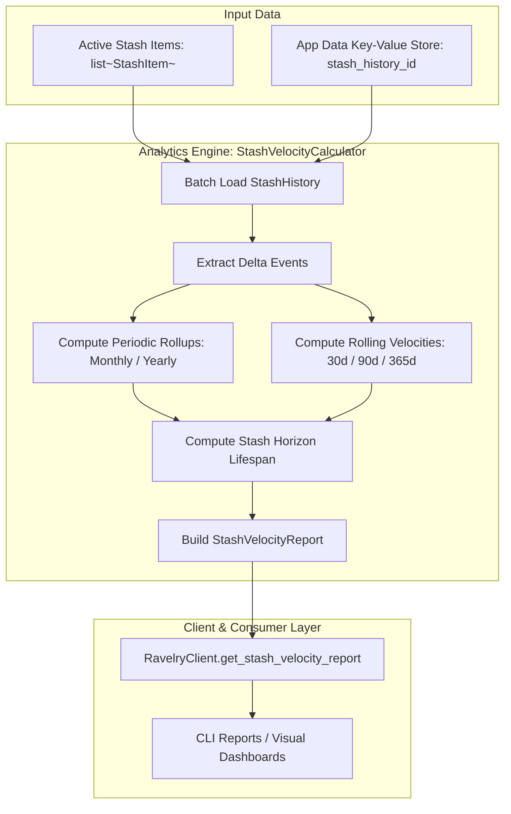

# Design Document: Stash Consumption Velocity & Analytics Engine

## 1. Overview & Objective
The **Consumption Velocity & Analytics Engine** processes historical stash snapshots stored in Ravelry's App Data key-value storage (`stash_history_{id}`) to calculate:
1. **Net Stash Flow**: Yardage and skeins added (acquired) versus used/knitted (consumed).
2. **Periodic Rollups**: Monthly, quarterly, and annual consumption summaries.
3. **Rolling Velocity Windows**: Current knitting pace across 30-day, 90-day, and 365-day horizons (yards/day and yards/month).
4. **Stash Lifespan Horizon**: Projected time remaining to deplete the current active stash based on recent consumption pace.

---

## 2. System Architecture & Data Flow



---

## 3. Data Models (`src/stashstats/models/analytics.py`)

### 3.1 `StashDeltaEvent`
Represents an atomic transition between two consecutive `StashHistoryEntry` snapshots:

```python
from datetime import datetime
from pydantic import BaseModel


class StashDeltaEvent(BaseModel):
    """An atomic change event in stash quantity between two snapshots."""

    stash_id: int
    """Unique stash item database ID."""

    timestamp: str
    """Ravelry timestamp string of the event."""

    delta_skeins: float
    """Change in skeins (negative = consumed, positive = acquired)."""

    delta_grams: float
    """Change in weight in grams."""

    delta_yards: float
    """Change in length in yards."""

    event_type: str
    """Classification: 'consumed' (delta < 0), 'acquired' (delta > 0), or 'initial'."""

    @property
    def datetime(self) -> datetime | None:
        """Parsed timezone-aware datetime."""
        try:
            return datetime.strptime(self.timestamp, "%Y/%m/%d %H:%M:%S %z")
        except (ValueError, TypeError):
            return None
```

---

### 3.2 `PeriodicRollup`
Aggregates deltas across standard calendar intervals (e.g. `2026-08` for monthly, `2026` for yearly):

```python
class PeriodicRollup(BaseModel):
    """Summary of stash flow over a calendar period."""

    period: str
    """Period label (e.g. '2026-08' or '2026')."""

    acquired_yards: float = 0.0
    """Total yardage added to stash during period."""

    consumed_yards: float = 0.0
    """Total yardage consumed/knitted during period."""

    net_yards: float = 0.0
    """Net yardage change (acquired - consumed)."""

    acquired_skeins: float = 0.0
    """Total skeins added during period."""

    consumed_skeins: float = 0.0
    """Total skeins consumed during period."""

    net_skeins: float = 0.0
    """Net skein change (acquired - consumed)."""

    event_count: int = 0
    """Number of delta events recorded in this period."""
```

---

### 3.3 `RollingVelocity`
Measures consumption pace across trailing time windows:

```python
class RollingVelocity(BaseModel):
    """Trailing velocity metrics over a rolling day window."""

    window_days: int
    """Number of days in trailing window (e.g., 30, 90, 365)."""

    yards_consumed: float
    """Total yards consumed within this trailing window."""

    skeins_consumed: float
    """Total skeins consumed within this trailing window."""

    yards_per_day: float
    """Average daily knitting pace in yards."""

    yards_per_month: float
    """Estimated 30-day monthly burn rate (yards_per_day * 30.4375)."""

    skeins_per_month: float
    """Estimated monthly skein consumption rate."""
```

---

### 3.4 `StashHorizon`
Projects stash lifespan based on current active inventory and trailing velocity:

```python
class StashHorizon(BaseModel):
    """Projection of stash depletion timeline."""

    total_active_yards: float
    """Current total yardage in active stash."""

    total_active_skeins: float
    """Current total skeins in active stash."""

    monthly_burn_rate_yards: float
    """Baseline monthly consumption rate used for projection."""

    months_remaining: float | None = None
    """Estimated months until stash depletion (None if burn rate is 0)."""

    years_remaining: float | None = None
    """Estimated years until stash depletion."""

    is_growing: bool = False
    """True if acquisition velocity exceeds consumption velocity."""
```

---

### 3.5 `StashVelocityReport`
The top-level composite report:

```python
class StashVelocityReport(BaseModel):
    """Complete consumption velocity and stash flow report."""

    total_active_yards: float
    """Current active stash yardage."""

    total_active_skeins: float
    """Current active stash skeins."""

    total_active_items: int
    """Total count of items currently in stash."""

    periodic_monthly: list[PeriodicRollup] = []
    """Monthly breakdown of acquisition and consumption."""

    periodic_yearly: list[PeriodicRollup] = []
    """Yearly breakdown of acquisition and consumption."""

    velocity_30d: RollingVelocity | None = None
    """Rolling 30-day pace."""

    velocity_90d: RollingVelocity | None = None
    """Rolling 90-day pace."""

    velocity_365d: RollingVelocity | None = None
    """Rolling 365-day annual pace."""

    horizon: StashHorizon
    """Stash lifespan estimation."""
```

---

## 4. Analytics Engine Implementation (`src/stashstats/analytics/velocity.py`)

A pure, decoupled calculator module:

```python
class StashVelocityCalculator:
    """Computes delta events, periodic rollups, and rolling velocities from stash histories."""

    @staticmethod
    def extract_events(histories: dict[int, StashHistory]) -> list[StashDeltaEvent]:
        """Extracts chronological transition events from snapshot histories."""
        ...

    @staticmethod
    def calculate_periodic_rollups(
        events: list[StashDeltaEvent],
        granularity: str = "monthly",
    ) -> list[PeriodicRollup]:
        """Groups delta events into calendar periods (YYYY-MM or YYYY)."""
        ...

    @staticmethod
    def calculate_rolling_velocity(
        events: list[StashDeltaEvent],
        window_days: int,
        as_of: datetime | None = None,
    ) -> RollingVelocity:
        """Calculates consumption rate across a trailing window of N days."""
        ...

    @staticmethod
    def calculate_horizon(
        total_active_yards: float,
        total_active_skeins: float,
        monthly_burn_rate_yards: float,
        net_inflow_rate_yards: float = 0.0,
    ) -> StashHorizon:
        """Projects months and years remaining based on active inventory."""
        ...

    @classmethod
    def generate_report(
        cls,
        stash_items: list[StashItem],
        histories: dict[int, StashHistory],
        as_of: datetime | None = None,
    ) -> StashVelocityReport:
        """Generates a complete StashVelocityReport."""
        ...
```

---

## 5. Client Integration Method

Added to `RavelryClient` (`src/stashstats/client.py`):

```python
def get_stash_velocity_report(self) -> StashVelocityReport:
    """Fetch user stash, batch-load App Data quantity histories, and compute velocity report."""
    # 1. Fetch user stash
    my_stash = self.get_my_stash()
    stash_items = my_stash.stash

    # 2. Batch load App Data histories
    stash_ids = [item.id for item in stash_items]
    histories = self.get_batch_stash_history(stash_ids)

    # 3. Compute report
    return StashVelocityCalculator.generate_report(stash_items, histories)
```

---

## 6. Sample Report Output Format

```text
======================================================================
STASH CONSUMPTION VELOCITY & HORIZON REPORT
======================================================================
Current Active Stash : 2,232.0 yards (10.0 skeins across 2 items)

--- ROLLING CONSUMPTION PACE ---
Trailing 30 Days     : 18.2 yards/day  |  553.7 yards/month (2.5 skeins/mo)
Trailing 90 Days     : 14.5 yards/day  |  441.3 yards/month (1.9 skeins/mo)
Trailing 365 Days    : 12.0 yards/day  |  365.2 yards/month (1.6 skeins/mo)

--- STASH LIFESPAN HORIZON ---
Current Velocity     : 553.7 yards/month
Projected Depletion  : 4.0 Months (0.33 Years)

--- MONTHLY STASH FLOW (2026) ---
Month       Acquired (yds)   Consumed (yds)    Net Change
---------------------------------------------------------
2026-06            0.0            420.0        -420.0 yds
2026-07          853.0            210.0        +643.0 yds
2026-08        1,379.0            420.0        +959.0 yds
======================================================================
```
