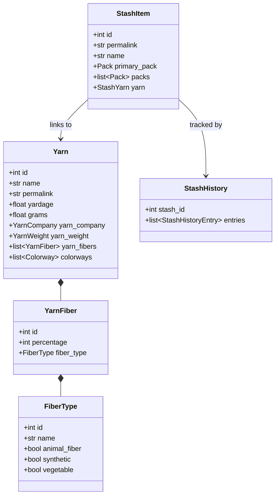

# Design Plan: MVP Pydantic Data Models

## Goal Description
Build out the focused set of Pydantic models required for core StashStats functionality:
1. Searching and inspecting commercial yarns (including full yarn details, fiber composition, and colorways).
2. Searching, filtering, and querying stashes (including stash search envelopes and detail envelopes).
3. Classifying stash stats (fiber categories, yarn weights, color families).

---

## Model Relationships

---

## Implemented Models

1. **Yarn Inspection (`src/stashstats/models/yarn.py`)**:
   - `FiberType`: Categorizes material source (`animal_fiber`, `synthetic`, `vegetable`) and names (`Merino`, `Silk`, `Nylon`).
   - `YarnFiber`: Pairs `FiberType` with composition percentage.
   - `Colorway`: Commercial colorway record (`id`, `name`, `color_family_id`).
   - `Yarn`: Full yarn detail model (`yarn_fibers`, `yarn_company`, `yarn_weight`, `photos`, `rating_average`, `rating_count`, `discontinued`, `texture`, `machine_washable`).
   - `YarnDetailResponse`: Envelope for `GET /yarns/{id}.json`.

2. **Stash Envelopes (`src/stashstats/models/stash.py`)**:
   - `StashDetailResponse`: Envelope for `GET /people/{username}/stash/{id}.json`.
   - `StashSearchResponse`: Envelope for `GET /stash/search.json` (`paginator`, `stashes: list[StashItem]`).

3. **Reference Classifications (`src/stashstats/models/reference.py`)**:
   - `ColorFamily`: 20 standard Ravelry color categories (`GET /color_families.json`).
   - `YarnWeightReference`: 13 standard yarn weight classifications with WPI, ply, and gauge boundaries (`GET /yarn_weights.json`).
   - `FiberCategory`: 10 top-level material groupings (`GET /fiber_categories.json`).
