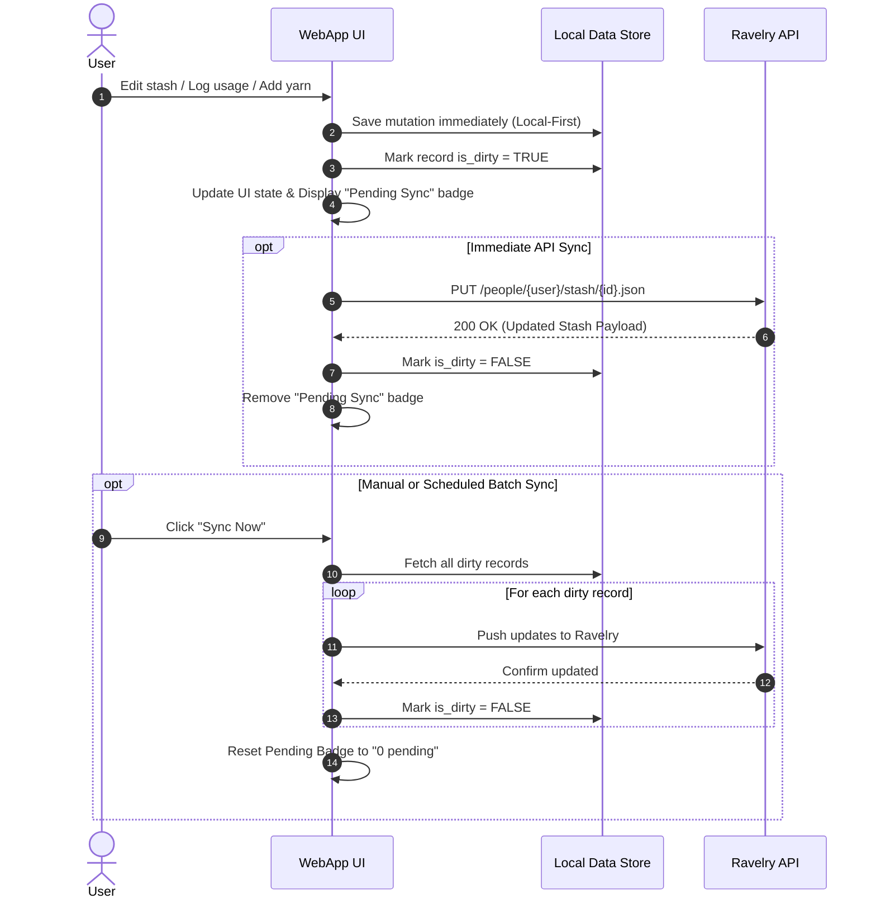

# Web Application Specification

> Implementation-agnostic visual and functional specification for the StashStats user interface.
> Defines screen layouts, information hierarchy, interactive components, state transitions, and supported features.

---

## 1. Design & Visual System

### Theme & Color Palette
The interface utilizes a modern dark theme with clean high-contrast visual demarcations and responsive spacing:

| Token / Role | Hex Code / Style | Usage |
|---|---|---|
| **Background Primary** | `#222222` | App body, main container background |
| **Card & Surface Background** | `#303030` / `#333333` | Accordion headers, card bodies, inputs |
| **Border & Dividers** | `#444444` / `#555555` | Card borders, input group outlines, horizontal rules |
| **Primary Accent / Brand** | `#00bc8c` (Teal Green) | Active tab highlight, brand titles, positive trends |
| **Info / Secondary Accent** | `#17a2b8` (Cyan Blue) | Skein counters, project progress bars, info badges |
| **Warning Accent** | `#ffc107` / `#f39c12` (Amber) | Weight counters, dirty sync indicator, 90-day predictions |
| **Danger Accent** | `#e74c3c` (Red) | Delete buttons, frogged project status, OLS trendlines |
| **Text Primary** | `#ffffff` | Headings, primary metrics, active control text |
| **Text Muted** | `#cccccc` / `#999999` | Subtitles, labels, timestamps, secondary notes |

---

## 2. Global Layout & Navigation

```
+---------------------------------------------------------------------------------------+
|  [Logo] StashStats                                             User: @Thotsky (Sync)  |
+---------------------------------------------------------------------------------------+
|  [ Personal Stash ]   [ Stash Analytics ]   [ Projects ]   [ Yarn Search ]           |
+---------------------------------------------------------------------------------------+
|                                                                                       |
|  [Active Tab Content Container]                                                       |
|                                                                                       |
+---------------------------------------------------------------------------------------+
```

### Global Header
- **Branding**: Displays application title ("StashStats") with prominent brand styling.
- **User Identity & Status**: Shows currently authenticated Ravelry username (e.g. `@Thotsky` via [[api-people-and-current-user]]).
- **Navigation Tabs**:
  1. `Personal Stash` (default landing view)
  2. `Stash Analytics` (visual metrics & timeseries charts)
  3. `Projects` (active/completed crafting projects)
  4. `Yarn Search` (global Ravelry catalog discovery & fast ingestion)

---

## 3. View 1: Personal Stash

The primary inventory workspace providing a grouped, filterable, and editable catalog of all owned yarns and fibers.

```
+---------------------------------------------------------------------------------------+
|  [Sync Now (2 pending)]  Last synced: Today 14:32                                     |
|  +------------------------------------------------------+  +-----------------------+  |
|  | Filter stash by yarn name, brand, or colorway...    |  | Sort: Brand (A-Z) v   |  |
|  +------------------------------------------------------+  +-----------------------+  |
+---------------------------------------------------------------------------------------+
|  [+] [Img] Malabrigo — Rios                       [ 3 items | 4.5 sk | 945 yds ] [v]  |
|      -------------------------------------------------------------------------------  |
|      Colorway: Diana | Dye Lot: 42 | Loc: Box 3       3.0 sk (630 yds / 300 g) [Edit] |
|      Colorway: Frank Ochre | Loc: Shelf 1             1.5 sk (315 yds / 150 g) [Edit] |
+---------------------------------------------------------------------------------------+
|  [+] [Img] Cascade Yarns — 220 Superwash          [ 1 item  | 2.0 sk | 440 yds ] [v]  |
+---------------------------------------------------------------------------------------+
|                            [ << ] [ 1 ] [ 2 ] [ 3 ] [ >> ]                            |
+---------------------------------------------------------------------------------------+
```

### Top Controls Bar
1. **Sync Action Row**:
   - **Sync Now Button**: Triggers bi-directional synchronization with Ravelry.
   - **Pending Badge**: Visual indicator (`N pending`) showing count of uncommitted/dirty local changes.
   - **Sync Timestamp**: Displays last successful synchronization time.
2. **Search Filter Input**:
   - Live debounced search querying across yarn name, brand name, and colorway names.
3. **Sort Selector Dropdown**:
   - `Brand (A-Z)` (Default)
   - `Name (A-Z)`
   - `Quantity (High-Low)` (Sorts by total skeins in group descending)
   - `Date Added (Newest)` (Sorts by most recent stash addition date descending)

### Grouped Stash List (Accordion Pattern)
To eliminate duplicate visual clutter, stash entries sharing the same parent yarn (Brand + Product Name) are grouped into a single collapsible card:

- **Group Card Header**:
  - **Thumbnail Image**: Product photo or first available colorway image (35x35px rounded square).
  - **Group Title**: `[Brand Name] — [Yarn Product Name]` (e.g. `Malabrigo — Rios`).
  - **Aggregate Badge**: Total entries and sum metrics (e.g. `3 items | 4.5 sk | 945 yds`).
  - **Expand/Collapse Trigger**: Chevron icon indicating collapsed/expanded state.
- **Expanded Colorway Rows**:
  - Each item in the group represents an individual stash record (`[[stash-model]]`):
    - **Colorway Name**: Bold accent text.
    - **Dye Lot**: Badge or tag if present.
    - **Location**: Storage location indicator (e.g. `Loc: Closet Box 2`).
    - **Quantity Readout**: Formatted in skeins, yards, meters, and grams (or grams/ounces for spinning fiber).
    - **Status Badge**: Color-coded status (`In stash`, `Used up`, `Gifted`, `Gone / Sold`).
    - **Pending Sync Badge**: Displayed if the record has unsynced local mutations.
    - **Notes Snippet**: Optional italicized user notes with left border accent.
    - **Edit Action**: Direct button triggering the Edit & Usage Modal for that specific stash record.

### Pagination
- Standard 10 grouped yarn items per page.
- Direct page selection buttons with Previous/Next controls.

---

## 4. View 2: Stash Edit & Usage Modal

A dedicated two-tab modal dialog supporting metadata correction, inventory usage deductions, and usage history audit.

```
+---------------------------------------------------------------------------------------+
|  Edit Stash Entry: Malabrigo — Rios                                               [X] |
+---------------------------------------------------------------------------------------+
|  [ Edit Details ]  [ Log Usage ]                                                      |
|  -----------------------------------------------------------------------------------  |
|  Originally stashed: 2026-02-10 (4.0 sk / 840 yds / 400 g)                            |
|                                                                                       |
|  Skeins Used: [ 1.5       ] skeins                                                    |
|  Date Used:   [ 2026-08-16 ]                                                          |
|                                                                                       |
|  +---------------------------------------------------------------------------------+  |
|  | Currently have: 4.0 skeins                                                      |  |
|  | Used: 1.5 skeins  ->  Remaining: 2.5 skeins                                     |  |
|  +---------------------------------------------------------------------------------+  |
|                                                                                       |
|  Usage History:                                                                       |
|  +------------+------------+------------+------------+-----------------------------+  |
|  | Date       | Skeins     | Yards      | Weight     | Action                      |  |
|  +------------+------------+------------+------------+-----------------------------+  |
|  | 2026-05-12 | -1.50 sk   | -315 yds   | -150 g     | [ Delete ]                  |  |
|  +------------+------------+------------+------------+-----------------------------+  |
+---------------------------------------------------------------------------------------+
|  [ Delete Entry ]                                       [ Save Changes ]  [ Cancel ]  |
+---------------------------------------------------------------------------------------+
```

### Tab 1: Edit Details
Form fields for updating static metadata of the stash item:
- **Colorway**: Text input / dropdown for colorway name.
- **Dye Lot**: Dye lot alphanumeric code.
- **Location**: Storage location text (e.g. `Bin A3`).
- **Total Skeins**: Exact decimal quantity input (step 0.1 / 0.25).
- **Stash Status Dropdown**:
  - `In stash` (Active inventory)
  - `Used up` (Fully consumed)
  - `Gifted` (Transferred to another crafter)
  - `Gone / Sold` (De-stashed / sold)
- **Notes**: Multiline text area.

### Tab 2: Log Usage & History Ledger
Designed for project deductions and incremental crafting consumption:
- **Baseline Display**: Summarizes the original purchase baseline (`Originally stashed: YYYY-MM-DD (X sk / Y yds / Z g)`).
- **Skeins Used Input**: Decimal number of skeins consumed in a project.
- **Date Used**: Date picker defaulting to current date.
- **Real-Time Remaining Preview**:
  - Instantly computes `Remaining = Current - Used`.
  - Validation styling: Green for valid remaining quantities; Warning badge if used exceeds current amount; Error if negative.
  - Proportional length/weight math: Deducts proportional yards, meters, and grams based on original skein baseline ratio.
- **Usage History Audit Table**:
  - Lists chronological past usage events for this stash item.
  - Columns: `Date`, `Skeins`, `Yards`, `Weight`, `Action`.
  - **Revert / Delete Action**: Clicking `Delete` removes the usage entry from local history and automatically restores the consumed skeins/yardage back to the stash entry.

### Modal Footer Actions
- **Delete Entry**: Danger button. Prompts confirmation dialog before permanently removing the stash item from Ravelry and local cache.
- **Save Changes**: Primary action. Persists updates locally, marks the record dirty, and pushes changes to Ravelry.
- **Cancel**: Closes dialog without modifications.

---

## 5. View 3: Stash Analytics & Visualizations

Rich analytical dashboard providing macroscopic visibility into stash accumulation, composition, and consumption velocity over time.

```
+---------------------------------------------------------------------------------------+
|  Stash Analytics Overview                                                             |
|  +--------------------+  +--------------------+  +------------------+  +------------+ |
|  | YARDAGE            |  | METERS             |  | SKEINS           |  | WEIGHT     | |
|  | 14,250 yds         |  | 13,030 m           |  | 68.5             |  | 7,420 g    | |
|  +--------------------+  +--------------------+  +------------------+  +------------+ |
|                                                                                       |
|  Metric: [ Yardage (yards) v ]   [x] 30-Day Moving Avg   [x] Trendline   [ ] Predict  |
|  +---------------------------------------------------------------------------------+  |
|  | [Line Chart: Cumulative Stashed Yardage Over Time]                              |  |
|  |                                                                                 |  |
|  | (1m) (6m) (YTD) (1y) (All)                      [=== Range Slider ===]          |  |
|  +---------------------------------------------------------------------------------+  |
+---------------------------------------------------------------------------------------+
```

### Summary Metric Cards (Top Row)
Four responsive KPI cards summarizing current total inventory:
1. **Yardage**: Total stashed yards (e.g. `14,250 yds`).
2. **Meters**: Total stashed meters (e.g. `13,030 m`).
3. **Skeins**: Total stashed skeins count (e.g. `68.5 sk`).
4. **Weight**: Total stashed weight in grams (e.g. `7,420 g`).

### Analysis & Metric Selector Bar
- **Metric Dropdown Options**:
  - `Yardage (yards)`
  - `Meters (m)`
  - `Skeins (qty)`
  - `Weight (grams)`
  - `All Metrics (Grid)` (Renders a 2x2 multi-chart layout)
  - `Animated Category Growth (Scatter)`
- **Analytical Overlays**:
  - **30-Day Moving Average**: Rolling 30-day mean smoothing short-term spikes.
  - **Show Trendline (OLS)**: Ordinary Least Squares linear regression line modeling overall stash growth trajectory.
  - **Show Prediction (90 Days)**: Extrapolates 90 days into the future based on historical intake and usage rate.

### Chart Types

#### 1. Cumulative Timeseries Line Graph
- **X-Axis**: Date timeline (from earliest stash addition to present).
- **Y-Axis**: Cumulative quantity (Yards, Meters, Skeins, or Weight).
- **Step-Shape / Interpolation**: Shows stepped increases on stash intake dates and decrements on project consumption/usage dates.
- **Interactive Range Controls**: Range slider bar + quick zoom buttons (`1m`, `6m`, `YTD`, `1y`, `All`).
- **Hover Card**: Formatted tooltip showing date, exact metric value, and metric unit.

#### 2. 2D Animated Category Growth (Scatter Animation)
- **Concept**: Visualizes the shifting composition of the stash over time across different yarn weight classes (Fingering, DK, Worsted, Bulky, Lace).
- **Axes**: X-Axis = Cumulative Length (Yards); Y-Axis = Cumulative Weight (Grams).
- **Animation Frames**: Monthly time slices from first stash date to present with Play/Pause and scrubber controls.
- **Visual Encoding**:
  - Color = Yarn Weight Category (`category`).
  - Bubble Size = Total Skein volume (`size_skeins`).
  - Hover = Category name, cumulative yards, cumulative grams.

---

## 6. View 4: Projects Showcase

Catalog view displaying the user's active and completed crafting projects (`[[project-model]]`), establishing the connection between stash consumption and project output.

```
+---------------------------------------------------------------------------------------+
|  My Projects                                                                          |
|  +---------------------------------------------------------------------------------+  |
|  | [Photo]  Reyna Shawl                                          [ In Progress ]   |  |
|  |          Craft: Knitting | Pattern: Reyna                                       |  |
|  |          [======================== 65% =========================]               |  |
|  |          Started: 2026-06-01                                                    |  |
|  |          "Using single-ply fingering weight merino..."                          |  |
|  |                                                             [ View on Ravelry ] |  |
|  +---------------------------------------------------------------------------------+  |
+---------------------------------------------------------------------------------------+
```

### Project Card Layout
- **Project Thumbnail**: Main project image or craft placeholder icon.
- **Title & Status Badge**:
  - `completed` / `finished` (Success Green)
  - `in progress` (Info Blue)
  - `hibernating` (Warning Amber)
  - `frogged` (Danger Red)
- **Metadata**:
  - Craft type (e.g. `Knitting`, `Crochet`, `Weaving`).
  - Pattern Name: Name of the linked pattern (`[[pattern-model]]`).
- **Progress Bar**: Animated striped progress bar displaying percentage completion (`0%` to `100%`).
- **Dates**: Started date and Completed date.
- **Notes Snippet**: Truncated project notes.
- **Direct External Link**: "View on Ravelry" button opening the live project page in a new browser tab.

---

## 7. View 5: Yarn Catalog Search & Ingestion

Global search interface querying the external Ravelry catalog (`[[api-yarns-and-companies]]`) with inline stash addition forms.

```
+---------------------------------------------------------------------------------------+
|  Category: [ Yarns v ]   Search: [ Malabrigo Rios       ]   Sort: [ Best Match v ]    |
|  [ Submit ]                                                                           |
+---------------------------------------------------------------------------------------+
|  [+] Malabrigo — Rios                                                             [v] |
|      Company: Malabrigo | Weight: 100g | Yardage: 210 yards | Washable: Yes           |
|      Colorways: [ Diana ] [ Frank Ochre ] [ Aguas ] [ Cereza ] [ Piedras ]            |
|      -------------------------------------------------------------------------------  |
|      Add to Stash:                                                                    |
|      Skeins: [ 2.0 ]   Colorway: [ Diana v ]   Dye Lot: [ 42      ]                   |
|      Location: [ Closet ]   Notes: [ Soft worsted ]   Date: [ 2026-08-16 ]            |
|      [ Add Yarn to Stash ]                                                            |
+---------------------------------------------------------------------------------------+
```

### Search Controls
- **Category Filter**: `Yarns`, `Yarn Companies`, `Personal Stash`, `Projects`, `Patterns`.
- **Query Input**: Keyword search term.
- **Sort Options**: `Best Match`, `Highest Rating`, `Most Projects`.

### Search Results Accordion Item
- **Product Header**: `[Company Name] — [Yarn Name]`.
- **Specs Readout**: Skein weight (grams), yardage (yards), discontinued flag, machine washable flag.
- **Colorway Badges**: List of known official colorway tags.
- **Image Gallery / Carousel**: Multi-photo carousel displaying yarn colorways and skein shots.
- **Inline Add-to-Stash Form**:
  - Skeins count input.
  - Colorway selector (dropdown populated from known colorways, or freetext fallback).
  - Dye lot input.
  - Location input.
  - Notes input.
  - Date Added picker.
  - Action: "Add Yarn to Stash" button.

---

## 8. Data Flow & Synchronization Model



### Key Behavioral Rules
1. **Local-First Resilience**: All UI edits, usage log deductions, and additions take effect locally immediately; network or API failures do not freeze or rollback the user's interface.
2. **Dirty Tracking**: Any record created or modified locally without confirmed API persistence carries a `Pending Sync` badge and increments the global sync counter.
3. **Usage Ledger Rollback**: Deleting a historical usage ledger row restores the exact deducted quantities to the current active stash record.
4. **Project Deduction Binding**: Assigning a stash pack to a project or updating status to `Used up` (`stash_status_id=2`) or `Gone / Sold` (`stash_status_id=4`) registers a negative consumption event on the project/update timestamp in analytics.

---

## Cross-References
- [[stash-model]] — Stash entity and pack schema.
- [[yarn-model]] — Parent yarn base model and specifications.
- [[project-model]] — User project entity and progress tracking.
- [[pack-model]] — Skein and batch allocations.
- [[api-stash]] — Ravelry Stash API endpoints.
- [[consumption-velocity-analytics]] — Statistical formulas for velocity and lifespan horizon.
