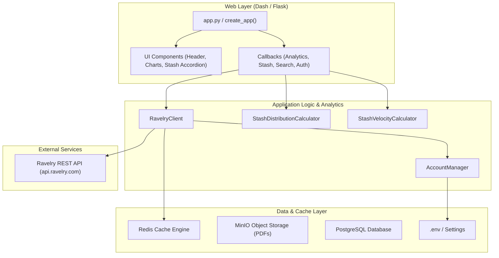

# System Architecture

*Navigation: [[index|← StashStats Index]] / System Architecture*

StashStats is designed as a modular, container-ready Python application separating data synchronization, analytical processing, and interactive web visualization.

## System Overview

## Core Components

1. **Dashboard & Web Layer**: Implemented using Dash and Flask. Provides real-time interactive visualization of yarn inventory, stash distributions, and progress. See [[web-app|Web Application]].
2. **Ravelry API Client**: A layered HTTP client built with `httpx` and `pydantic`. Supports HTTP Basic Auth, automatic pagination, ETag caching, and rate limiting. See [[client-overview|Client Architecture]].
3. **Domain Models**: Strongly-typed Pydantic models for parsing, validating, and normalizing upstream Ravelry JSON payloads. See [[models-overview|Domain Models Overview]].
4. **Analytics Engine**: Pure Python and pandas calculations for multidimensional stash grouping, consumption rates, and timeline projections. See [[analytics-overview|Analytics Engine Overview]].
5. **Authentication & Accounts**: Dual-account credentials management with runtime environment toggling. See [[auth|Authentication & Accounts]].

## Docker Services

The application environment is orchestrated via `docker-compose.yml`:

- **web**: Main Dash application container running with hot-reloading in dev.
- **redis**: Key-value cache store for API responses and rate limit tokens.
- **db**: PostgreSQL database for structured cache data and analytics storage.
- **minio**: Local S3-compatible storage for offline project pattern PDFs.

## Subsystem Navigation

- **Authentication**: [[auth|Authentication & Accounts]]
- **API Client**: [[client-overview|Client Architecture]] · [[client-stash|Stash Operations]] · [[client-yarn|Yarn Operations]] · [[client-projects|Project Operations]]
- **Domain Models**: [[models-overview|Models Overview]] · [[models-stash|Stash Models]] · [[models-yarn|Yarn Models]] · [[models-project|Project Models]]
- **Analytics Engine**: [[analytics-overview|Analytics Overview]] · [[analytics-distributions|Categorical Distributions]] · [[analytics-velocity|Consumption Velocity]] · [[analytics-projects|Project Analytics]]
- **Web UI**: [[web-app|Web Application]] · [[web-callbacks|Dash Callbacks]] · [[web-components|UI Components]]
