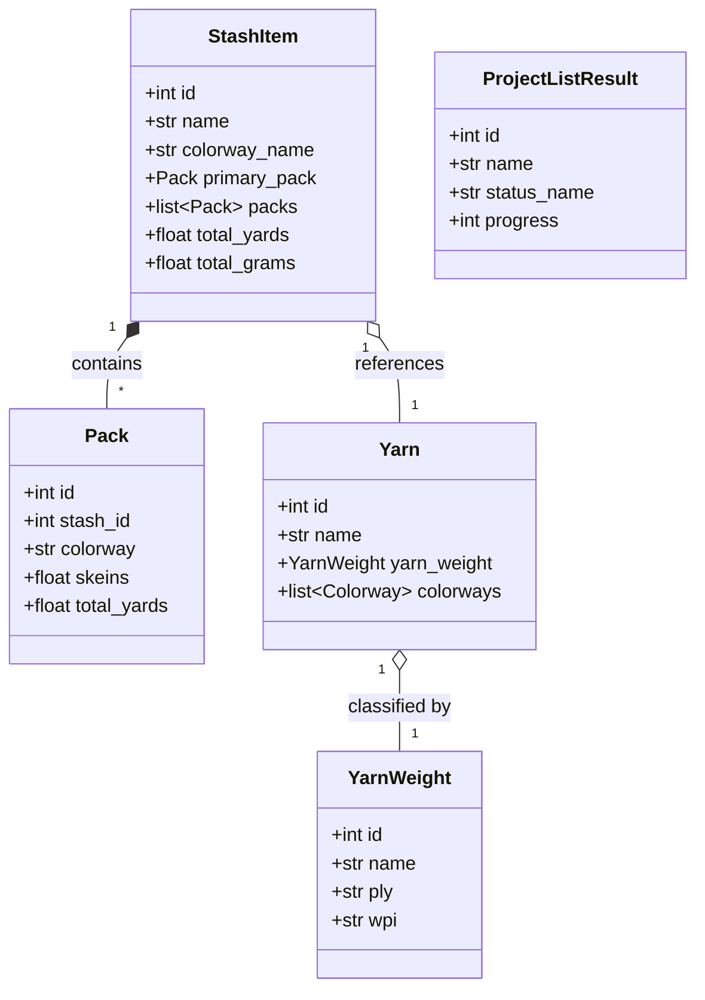

# Domain Models Overview

*Navigation: [[index|← StashStats Index]] / [[architecture|System Architecture]] / Domain Models Overview*

StashStats implements a comprehensive schema of Pydantic V2 models to validate incoming JSON structures, coerce data types, and normalize nested Ravelry entities.

## Model Hierarchy

## Validation & Normalization

All models enforce strict non-negative constraints on measurements (grams, yards, meters, skeins) and use `@model_validator(mode="after")` to backfill aggregated fields from underlying packs.

## Domain Model Submodules

- **Stash Models**: [[models-stash|Stash Domain Models]] — `StashItem`, `Pack`, `StashStatus`.
- **Yarn Models**: [[models-yarn|Yarn Domain Models]] — `Yarn`, `YarnWeight`, `Colorway`.
- **Project Models**: [[models-project|Project Domain Models]] — `ProjectListResult`, `Project`.

## Integration Links

- **Client Suite**: [[client-overview|API Client Architecture]]
- **Analytics Engine**: [[analytics-overview|Analytics Engine Overview]]
- **Architecture**: [[architecture|System Architecture]]
